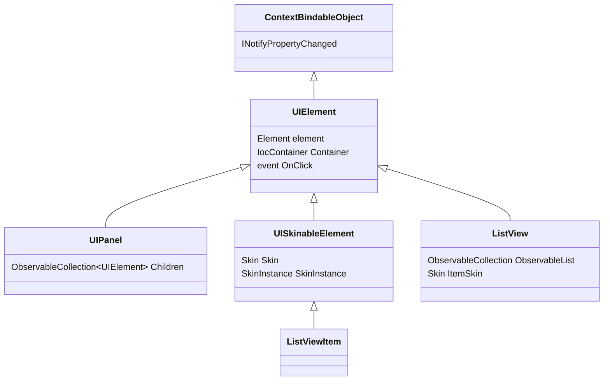

# Sunlight.Framework.UI (controls)

> **Audience:** *App authors*.

## TL;DR

`Sunlight.Framework.UI` provides the **UIElement** base class with two parallel subclass families — `UIPanel` (typed `Children` collection) and `UISkinableElement` (template materialisation via `Skin` / `SkinInstance`) — plus `ListView` (a direct `UIElement` subclass for collection rendering). The `Skin` / `SkinInstance` system materialises a [Razor](../templates/razor.md) or [XWML](../templates/xwml.md) template against a data context, and the binding-strategy attributes (`AutoFire`, `DefaultDataBinding`, `NonBindable`) shape how templates resolve properties.

## Reference — class hierarchy



| Class | Purpose |
|---|---|
| `UIElement` | Base for every control. Wraps a DOM `Element`, exposes `CssClass` (synced with `Element.ClassName`), bound events (`OnClick`, …), and is itself an `ObservableObject` so its properties can be data-bound. |
| `UIPanel` | Adds a typed `Children` `ObservableCollection<UIElement>` that mirrors DOM children. Subclasses pick layout. |
| `UISkinableElement` | Adds `Skin` + `SkinInstance` properties. Setting `Skin` triggers materialisation against the current data context using `IBindingStrategy` (see [ADR 0019](../adr/0019-extract-ibindingstrategy-from-skininstance.md)). |
| `ListView` | A `<ul>`-tagged `UIElement` bound to either `FixedList` (`IList`) or `ObservableList` (`IObservableCollection`). Each item is rendered through `ItemSkin`. Optional `HeaderSkin`. `TopN` caps the visible count. |
| `ListViewItem` | The per-item control inside a `ListView`. |

## Reference — `Skin` / `SkinInstance` / `IBindingStrategy`

A `Skin` is the *factory* for a template instance. Materialising it produces a `SkinInstance` — the live DOM subtree with bindings hooked into the source object.

```csharp
public class Skin
{
    public Skin(Type skinableType, Type dataContextType,
                Func<Skin, Document, SkinInstance> factoryMethod, string id);

    public string Id { get; }
    public Type SkinableType { get; }
    public Type DataContextType { get; }
}
```

`SkinInstance` delegates the actual binding work to an `IBindingStrategy`:

- `LegacyBinderStrategy` — runs the [XWML](../templates/xwml.md) binder pipeline at runtime.
- `GraphBindingStrategy` — runs the compile-time DAG produced by the [Razor](../templates/razor.md) frontend ([ADR 0018](../adr/0018-replace-independent-binders-with-compile-time-reactive-binding-graph.md)).

Application code generally does not construct strategies directly — the template compiler emits the appropriate factory.

## Reference — Sunlight.Framework.UI attributes

| Attribute | Target | Effect | ADR |
|---|---|---|---|
| `[AutoFire(params string[] alsoFire)]` | Property | Compiler auto-emits a `FirePropertyChanged("X")` (and one per name in `alsoFire`) when the setter completes. Eliminates the boilerplate `if (old==new) return; old=new; FirePropertyChanged(...)`. | [0014](../adr/0014-standardize-the-observable-framework-as-the-reactive-binding-contract.md) |
| `[DefaultDataBinding(Mode = DataBindingMode.OneWay)]` | Property | Sets the default binding mode for templates referencing this property. `IsStrict = true` rejects mismatched modes at compile time. `DefaultValue` initialises the property when bound. | [0020](../adr/0020-auto-detect-binding-mode-from-roslyn-semantic-analysis.md) |
| `[NonBindable]` | Property | Excludes from template binding analysis. Useful when a property is on an `ObservableObject` but should not be reachable from `{Foo}` syntax. | — |
| `[Skin]` | Type | Marks a class as a control whose skin is loaded by `SkinFactory`. | — |
| `[SkinPart]` / `[TemplatePart]` | Field | Names a placeholder inside the skin that the host control will receive a reference to after materialisation. | — |
| `[TemplateBehavior]` | Type | Wires extra runtime behavior into a template at materialisation time. | — |
| `[TemplateFile]` | Type | Points at the `.html` (XWML) or `.skin.cshtml` (Razor) file backing the control. | — |
| `[TagName("ul")]` | Type | Pre-declares the DOM tag a control wraps; `ListView` declares `[TagName("ul")]` so `new ListView(Document.CreateElement("ul"))` is the canonical construction. | — |
| `[CssClass]` / `[CssName]` | Property / class | Marks CSS class members; `CssClass` integrates with strict-CSS template diagnostics ([ADR 0016](../adr/0016-standardize-xwml-as-the-canonical-template-language-with-strict-css-and-binding-diagnostics.md)). | 0016 |
| `[DomAttribute]` | Property | Marks a property whose setter writes through to the DOM `Element`'s attribute / property. | — |

## Quick start — a custom control

```csharp
using Sunlight.Framework.Observables;
using Sunlight.Framework.UI;
using Sunlight.Framework.UI.Attributes;
using System.Web.Html;

[TagName("button")]
public class ToggleButton : UIElement
{
    public ToggleButton(Element element) : base(element) { }

    [AutoFire]
    public bool IsOn { get; set; }

    [AutoFire("DisplayText")]
    public string Label { get; set; }

    public string DisplayText
    {
        get { return this.IsOn ? this.Label + " (on)" : this.Label; }
    }
}
```

`[AutoFire]` on `IsOn` and `Label` removes manual `FirePropertyChanged` calls. The `("DisplayText")` argument additionally fires `DisplayText` whenever `Label` changes — that's how a derived display value is kept fresh without manual subscription.

## Examples

### Bind a `ListView` to an `ObservableCollection`

```csharp
var list = new ListView(Document.CreateElement("ul"));
list.ObservableList = todos;             // ObservableCollection<TodoItem>
list.ItemSkin = SkinFactory.Resolve<TodoItem>("TodoItemSkin");
container.AppendChild(list.Element);
```

When `todos.Add(...)` fires, `ListView` reacts via `INotifyCollectionChanged` and instantiates a fresh `ListViewItem` from `ItemSkin` for the new entry. `TopN` caps the rendered count for very long lists; items past `TopN` are excluded entirely (no virtualisation — they are simply not in the DOM until `TopN` is increased).

### Use `[DefaultDataBinding]` to set a strict mode

```csharp
public class FilterViewModel : ObservableObject
{
    [DefaultDataBinding(Mode = DataBindingMode.TwoWay, IsStrict = true)]
    [AutoFire]
    public string Filter { get; set; }
}
```

A template that binds `{Filter}` in OneWay mode against this property will fail compilation: `IsStrict = true` requires an exact match.

### Hide a property from binding analysis

```csharp
public class CartViewModel : ObservableObject
{
    [AutoFire] public ObservableCollection<CartItem> Items { get; set; }

    [NonBindable]
    public IocContainer Container { get; set; }
}
```

`Container` is on the type for IoC reasons but should never be discovered by `{Container}` template syntax.

## Known gotchas

### `Children.Add` only — no manual `Element.AppendChild`

`UIPanel.Children` is the source of truth. The internal `ChildrenCollectionChanged` handler mirrors changes to the DOM `Element`. If you call `panel.Element.AppendChild(child.Element)` directly, the `Children` collection will be out of sync and removal won't work as expected.

### `ListView.TopN` is a hard cap, not a virtualisation hint

Items past `TopN` are not in the DOM. There is no automatic load-on-scroll. If you need virtualisation, build it as a separate control.

### `[AutoFire]` on a property without a setter is a no-op

The compiler emits the FirePropertyChanged hook in the setter body. A computed property (`get` only) has no setter to instrument; use `[AutoFire("ComputedName")]` on the dependency setter instead.

### `Skin` materialisation is synchronous

`SkinInstance` is built synchronously when `Skin` is set. Heavy templates can spike the main thread. For large dynamic surfaces, prefer streaming via `ListView` (which materialises items on demand as the collection mutates).

### `OnClick` (and other event properties) routes through `EventBinder`

This is by design — it's how `CallContext` roots a new action per user gesture (see [Sunlight Core](sunlight-core.md#reference--callcontext)). If you bypass it with raw `Element.AddEventListener` you opt out of trace propagation.

## Diagnostics

| Symptom | Cause |
|---|---|
| Property change in viewmodel doesn't refresh the rendered template | Property missing `[AutoFire]` (or manual `FirePropertyChanged` call) |
| Template binds to wrong/raw value | Missing `[DefaultDataBinding]` mode hint and binding analyzer fell back to `OneTime` |
| `ListView` items duplicate when collection updates | `ObservableList` and `FixedList` set simultaneously, or the same `ItemSkin` materialised twice |
| `Skin` set but `SkinInstance` is null | `dataContextType` mismatch with `DataContext` — strategy refused to build |

## Cross-links

- [Sunlight Core](sunlight-core.md) — observables, binders, IoC, logging
- [Razor templates](../templates/razor.md), [XWML templates](../templates/xwml.md)
- [ADR 0014 — Reactive contract](../adr/0014-standardize-the-observable-framework-as-the-reactive-binding-contract.md)
- [ADR 0016 — XWML strict CSS / binding diagnostics](../adr/0016-standardize-xwml-as-the-canonical-template-language-with-strict-css-and-binding-diagnostics.md)
- [ADR 0019 — `IBindingStrategy` extraction](../adr/0019-extract-ibindingstrategy-from-skininstance.md)
- [ADR 0020 — Auto-detect binding mode](../adr/0020-auto-detect-binding-mode-from-roslyn-semantic-analysis.md)
