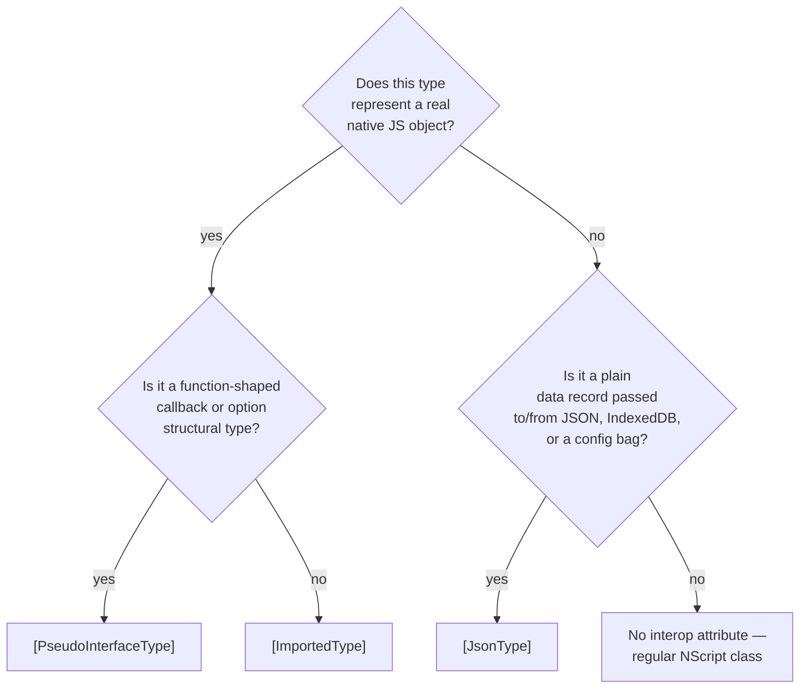

# `[ImportedType]`, `[JsonType]`, and `[PseudoInterfaceType]`

> **Audience:** *App authors* and *binders* writing typed wrappers around native JS APIs or JSON payloads.

## TL;DR

NScript models native JavaScript objects via three attributes that all sit at the type level and all carry compile-only semantics ([ADR 0010](../adr/0010-model-native-javascript-types-through-attributed-clr-facades.md)):

- `[ImportedType]` — the type *is* a real JS object (`Element`, `Date`, `Promise`). Member access compiles to direct field/method calls. NScript never allocates an instance — `new T()` calls the underlying JS constructor.
- `[JsonType]` — the type is a plain JSON record (e.g. `ClientRect`, `IDBObjectStoreParameters`). Field reads go through a runtime `importedExtension` shim so that JS-side property names (which may differ from the C# names) resolve correctly.
- `[PseudoInterfaceType]` — the type is a structural interface. No runtime metadata is emitted; assignability is by shape, not nominal. Useful for callback signatures.

## Reference — runtime emission shape

| Attribute | C# `obj.X` compiles to | C# `new T()` compiles to | C# `obj is T` |
|---|---|---|---|
| `[ImportedType]` | `obj.x` (or `obj.X` with `[PreserveCase]`) | `new T(...)` (calls native constructor) | Direct `instanceof` against the native global |
| `[JsonType]` | `importedExtension(obj, 'x')` (unwraps the JSON value) | `{}` (empty object literal) | Always `true` for any non-null object — JSON has no class identity |
| `[PseudoInterfaceType]` | `obj.x` (no metadata, structural) | Compile error — pseudo-interfaces aren't constructible | Always `true` for any non-null object |
| (default — neither) | `obj.get_X()` | `new $T(...)` (NScript-managed) | NScript metadata check |

## Reference — when to choose which



## Quick start

### `[ImportedType]` — wrap a real native JS class

```csharp
using System.Runtime.CompilerServices;

[ImportedType, IgnoreNamespace]
public sealed class Promise
{
    public extern Promise(Action<Action<object>, Action<object>> executor);
    [PreserveCase] public extern Promise Then(Action<object> onFulfilled);
    [PreserveCase] public extern Promise Catch(Action<object> onRejected);
}

// Usage:
var p = new Promise((resolve, reject) => resolve("done"));
p.Then(v => Console.WriteLine(v));

// Emits:
// var p = new Promise(function(resolve, reject) { resolve("done"); });
// p.then(function(v) { Console.WriteLine(v); });
```

`[PreserveCase]` is needed because NScript lowercases method names by default; native APIs don't.

### `[JsonType]` — typed shape over a JSON object

```csharp
[JsonType]
public sealed class ClientRect
{
    public extern double Top { get; }
    public extern double Left { get; }
    public extern double? Width { get; }
    public extern double? Height { get; }
}

// Usage from a DOM call:
ClientRect r = element.GetBoundingClientRect();
double area = r.Width.Value * r.Height.Value;
```

`extern` properties on `[JsonType]` — there is no body to emit. The compiler produces field access (`r.width`) wrapped in `importedExtension` to handle missing-key cases.

### `[PseudoInterfaceType]` — callback shape

```csharp
[PseudoInterfaceType]
public interface IDragHandler
{
    void OnDragStart(MouseEvent e);
    void OnDragEnd(MouseEvent e);
}

// Any object literal with these methods satisfies the interface — no class declaration needed.
```

## Examples

### Reading from a `[JsonType]` returned by a native call

```csharp
[JsonType, IgnoreNamespace]
public class IDBObjectStoreParameters
{
    public extern bool? AutoIncrement { get; set; }
    public extern string KeyPath { get; set; }
}

// Construct as plain literal:
var opts = new IDBObjectStoreParameters { AutoIncrement = true, KeyPath = "id" };
db.CreateObjectStore("todos", opts);
// Emits: db.createObjectStore("todos", { autoIncrement: true, keyPath: "id" });
```

The object literal initializer pattern is the only legal construction form for `[JsonType]` — there's no constructor body.

### Mixing `[ImportedType]` and `[JsonType]`

```csharp
[ImportedType, IgnoreNamespace, ScriptName("XMLHttpRequest")]
public sealed class XMLHttpRequest
{
    public extern XMLHttpRequest();
    [PreserveCase] public extern void Open(string method, string url, bool async);
    [PreserveCase] public extern void Send(object body);
    [PreserveCase] public extern string ResponseText { get; }
}

[JsonType]
public class TodoDto
{
    [PreserveCase] public string Id { get; set; }
    [PreserveCase] public string Title { get; set; }
}

// Combined usage:
var xhr = new XMLHttpRequest();
xhr.Open("GET", "/api/todos/1", true);
xhr.Send(null);
// Later:
TodoDto todo = (TodoDto)JSON.Parse(xhr.ResponseText);
Console.WriteLine(todo.Title);
```

`[ImportedType]` for the live XHR object; `[JsonType]` for the parsed payload. The cast to `TodoDto` is a no-op at runtime — it's purely for static typing.

### `[PseudoInterfaceType]` for option bags

```csharp
[PseudoInterfaceType]
public interface IFetchOptions
{
    string Method { get; }
    Dictionary<string, string> Headers { get; }
    string Body { get; }
}

// Any anonymous-shaped object satisfies this:
DoFetch("/api/save", new { Method = "POST", Body = "..." });
```

Useful for option records where you don't want the overhead of `[JsonType]`'s `importedExtension` wrapping.

## Known gotchas

### `[JsonType]` field access is wrapped — codegen plugins must mirror it

Field reads on `[JsonType]` types compile to `importedExtension(obj, 'fieldName')` not bare `obj.fieldName`. If you write a converter plugin that emits an `InlineObjectInitializer` and tag the type as `[JsonType]`, your direct `obj.fieldName` access from generated JS will not match. Use a regular NScript class with a real constructor instead. This is documented in [JST codegen rules](../compiler/plugins.md) but bites people often.

### `[ImportedType]` instances are not serializable across some boundaries

`structuredClone(element)` — `element` is an `[ImportedType]` `Element`, but cloning fails because DOM nodes aren't structured-cloneable. The attribute does *not* certify cloneability; it just says "this is a native object." Check the underlying object class before using it with structured-clone-based APIs (postMessage, IndexedDB, Worker transfer).

### Casting between `[JsonType]` types is always a no-op

`(TodoDto)anyJsonObject` always succeeds at runtime. `[JsonType]` has no class identity. If you need real type discrimination, encode a `Type` field and check it explicitly:

```csharp
if ((string)JSON.Parse(s).Type == "Todo") { ... }
```

### `[PseudoInterfaceType]` cannot be used as a generic constraint with `is`

`obj is IFoo` where `IFoo` is `[PseudoInterfaceType]` is always `true` (or `obj != null`) — there's no runtime metadata to test. Don't pivot logic on pseudo-interface checks.

### `extern` properties / methods only — no bodies

`[ImportedType]` and `[JsonType]` types' members must be `extern`. The compiler can't emit a body for a member of a type it doesn't allocate or own. Trying to add a body produces a converter error.

### `[JsonType]` properties named with `[PreserveCase]` to match server payload

If your JSON server returns `{"Title": "..."}`, you must add `[PreserveCase]` to the matching C# property — otherwise the emitter will look for `title` and get `undefined`.

### `null`-checks against `[JsonType]` results

`importedExtension` returns `undefined` for missing keys, which boxes to `null` in C# nullable types but to `0` / empty string in non-nullable value types. Use `double?`, `int?`, `string` (which already nulls), and check explicitly.

## Diagnostics

| Symptom | Cause |
|---|---|
| `obj.title is undefined` reading a JSON property | Server casing mismatch — add `[PreserveCase]` |
| `(MyDto)obj` returns the wrong-shaped object | `[JsonType]` casts are no-ops; runtime never validates the shape |
| Plugin-generated literal doesn't satisfy `[JsonType]` consumer | `importedExtension` wrapper missing on the consumer side; switch to a real class with constructor |
| `new T()` on a `[PseudoInterfaceType]` fails to compile | Pseudo-interfaces are not constructible; create an anonymous-typed object literal |
| Native API call gets `obj.foo` not `obj.Foo` | Missing `[PreserveCase]` on the wrapper member |
| `Cannot find name 'someProp'` at runtime | The wrapper declares a property name that the underlying JS object doesn't use; adjust `[ScriptName]` |

## Cross-links

- [ADR 0010 — Imported types pattern](../adr/0010-model-native-javascript-types-through-attributed-clr-facades.md)
- [Interop attributes reference](attributes.md)
- [`[Script]` blocks and dynamic JS](dynamic.md)
- [Framework Web & DOM](../framework/web.md)
- [Compiler plugins (JST codegen rules)](../compiler/plugins.md)
