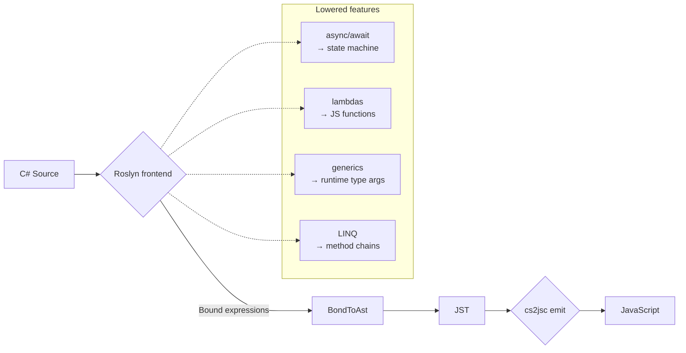

# C# language support and limitations

> **Audience:** *App authors* deciding whether a given C# feature will compile cleanly to JavaScript under NScript.

## TL;DR

NScript supports the **C# 8–13 surface area** for non-ref, non-reflective code targeting `netstandard2.1`. Framework and test-framework projects compile under `<LangVersion>13</LangVersion>`. The translatable subset includes classes, interfaces, generics, LINQ, lambdas, async/await (compiled through state machines into Promises), pattern matching (constant / declaration / discard / relational / logical / negated / extended-property), records and `record struct`, `with` expressions, `init` and `required` members, C# 12 collection expressions (`T[]` / `List<T>` / list-shaped BCL interface targets; `T[]` / `List<T>` / `IEnumerable<T>` spread sources), C# 12 primary constructors on plain classes, indices and ranges (`x[^1]`, `x[1..3]`), and null-coalescing. The hard exclusions are anything that requires the .NET runtime: `dynamic`, reflection, P/Invoke, `unsafe` / pointers, and iterator methods (`yield return` / `yield break`). The full per-feature breakdown lives in [`csharp9-13-status.md`](./csharp9-13-status.md); residual C# 8 bugs and open items are tracked in [csharp8-todos.md](../../csharp8-todos.md).

> **C# 9–13 caveats:** A handful of corners are **compile-time strict, runtime permissive** — Roslyn enforces them at every call site but no runtime check is emitted: `init` accessors, nullable reference types, and `required` members. `record class` value-equality (`r1 == r2` / `r1.Equals(r2)`) currently surfaces a runtime NRE because NScript's `mscorlib` returns `null` from `EqualityComparer<T>.Default`; reference-equality and `Deconstruct` are unaffected and the gap is tracked as a follow-up to issue #47. `record struct with` raises an actionable `NotImplementedException` from Stage 1 because struct codegen does not preserve value-copy semantics. `[CollectionBuilder]`-attributed user types and `Span<T>` / `ReadOnlySpan<T>` collection-expression targets are explicit non-goals — they depend on `Span<T>`, which has no JS runtime semantics.

## Reference — feature support matrix

| Feature | Status | Notes |
|---|---|---|
| Classes, structs (as classes), interfaces | ✅ Supported | Structs are emitted as classes; value semantics not preserved across assignment. See [ADR 0008](../adr/0008-define-how-class-and-interface-hierarchies-map-to-javascript.md). |
| Generics (open and closed) | ✅ Supported | Type arguments are first-class at runtime via JS function type metadata ([ADR 0007](../adr/0007-define-the-javascript-runtime-type-model.md)). |
| `IgnoreGenericArguments` opt-out | ✅ Supported | Skips type-argument emission at instantiation sites; used for type-erased natives. |
| Inheritance, virtual dispatch, abstract members | ✅ Supported | Prototype-chain wiring; non-virtual methods are devirtualised ([ADR 0023](../adr/0023-devirtualize-non-virtual-methods-and-inline-trivial-accessors.md)). |
| Interfaces with explicit metadata | ✅ Supported | Metadata maps emitted via `baseInterfaces` ([ADR 0008](../adr/0008-define-how-class-and-interface-hierarchies-map-to-javascript.md)). |
| `[PseudoInterfaceType]` | ✅ Supported | Structural interfaces with no runtime metadata. |
| LINQ-to-Objects | ✅ Supported | Compiled lambdas; `IEnumerable<T>` operators are framework code. |
| Lambdas, closures | ✅ Supported | JS function expressions; closure capture matches C# semantics. |
| `async` / `await` | ✅ Supported | State machine compilation; awaitables back onto JS Promises (`Task` ↔ `Promise`). |
| `Task<T>`, `Promise<T>` | ✅ Supported | `Task` is `[ImportedType]` aliased to JS `Promise`. |
| `IObservable<T>` (Rx) | ⚠️ Partial | `Sunlight.Framework.Observables` provides the reactive contract used by templates; it's *not* a port of System.Reactive. |
| Pattern matching (basic — `is Type`, `case`) | ✅ Supported | Type tests compile to `instanceof` plus metadata checks. |
| Switch expressions | ✅ Supported | Constant / declaration / discard / relational / logical / negated / extended-property arms all lower through the shared `PatternMatcher`. List patterns (`[1, 2, ..]`) and positional patterns are still open — see [`csharp9-13-status.md`](./csharp9-13-status.md). |
| Property / positional / list patterns | ❌ Open work | Property and positional patterns are tracked under Phase C in [`csharp9-13-status.md`](./csharp9-13-status.md); the C# 11 list pattern (`[1, 2, ..]`) shares that work item. Extended property patterns (`{ A.B: ... }`) ride the same path. |
| Indices and ranges (`x[^1]`, `x[1..3]`) | ✅ Supported (Phase F6) | `^x` and `x..y` lower to `new System.Index(...)` / `new System.Range(...)`. `arr[^1]` / `list[^1]` / `string[^1]` lower to `instance[idx.GetOffset(instance.Length-or-Count)]`; `arr[range]` lowers to `RuntimeHelpers.GetSubArray<T>(arr, range)`. Range slicing on `List<T>` and `string` is deferred to a follow-up (no `List<T>.Slice` facade member; `string.Substring`-by-Range needs more wiring). Validated in `Lang8IndexRangeTests.cs`. |
| Null-coalescing `??`, `??=` | ✅ Supported | `??=` is supported. |
| Null-conditional `?.`, `?[]` | ✅ Supported | Compiled to JS short-circuit chains. |
| Tuples, deconstruction | ✅ Supported | `ValueTuple` emits as a class; deconstruction is sugar over field reads. |
| Local functions | ✅ Supported | Including static local functions. |
| `using` declarations | ❌ Open work | Listed in C# 8 todos. |
| Nullable reference types (NRT) | ⚠️ Annotation-only | NScript respects `?` for code-gen but does not enforce non-null at runtime. |
| Default interface methods | ❌ Open work | Listed in C# 8 todos. |
| `dynamic` | ❌ Not supported | No DLR equivalent on the JS target. Use `[Script]` or `object` casts. |
| Reflection (`Type.GetMethod`, `Activator.CreateInstance` with args, `RuntimeTypeHandle`) | ❌ Not supported | Limited surface only — `typeof(T)` works for the runtime type model; full reflection does not. See [framework/core.md](../framework/core.md). |
| Iterators (`yield return`, `yield break`) | ❌ Not supported | The state-machine lowering for iterators isn't ported. Build collections eagerly or use Observables. |
| Asynchronous streams (`IAsyncEnumerable<T>`) | ❌ Open work | Listed in C# 8 todos. |
| `unsafe`, pointers, `stackalloc` | ❌ Not supported | No native memory model on the JS target. |
| P/Invoke, `[DllImport]` | ❌ Not supported | No interop boundary — use `[Script]` for native JS instead. |
| `lock` / monitors | ⚠️ No-op | JS is single-threaded; `lock` compiles but provides no synchronisation. |
| `try` / `catch` / `finally` | ✅ Supported | Compiled to JS `try`/`catch`/`finally`. |
| `throw` expressions | ⚠️ Bug | Pre-existing C# 8 codegen bug; tracked under "Fix throw expressions code generation" in [csharp8-todos.md](../../csharp8-todos.md). Use `throw` *statements* until fixed. |
| `params T[]` | ✅ Supported | Variadic JS calls. |
| Operator overloading | ✅ Supported | Operators emit as static methods. |
| Extension methods | ✅ Supported | Static methods invoked with instance syntax. |
| `string` interpolation `$"…"` (non-constant context) | ✅ Supported | Including verbatim `@$"…"`. Roslyn lowers each interpolation hole to `string.Concat` / `string.Format` calls before the bound tree reaches Stage 1. |
| `string` interpolation in a `const` context | ⚠️ Bug | `const string s = $"hello {Name}";` reaches Stage 1 as an unlowered `BoundInterpolatedString` and `VisitInterpolatedString` throws. Pre-existing C# 6 gap; expand to ordinary `string` constant concatenation until fixed. |
| Numeric `decimal` | ⚠️ Maps to `number` | No 128-bit decimal in JS; loss of precision past 2^53. |
| Numeric `long` / `ulong` | ⚠️ Maps to `number` | Loss of precision past 2^53. Use `BigInt` via `[Script]` for large integers. |
| `DateTime`, `TimeSpan` | ⚠️ Limited | Maps to JS `Date`; only the subset shipped in `mscorlib` is available. See [framework/core.md](../framework/core.md). |

## Reference — feature → emission summary



All C# constructs lower into the JST tree first; cs2jsc emits from JST to JavaScript.

## Examples

### What works

```csharp
public async Task<List<TodoDto>> LoadAsync()
{
    var resp = await fetchClient.GetAsync("/api/todos");
    var json = await resp.Content.ReadAsStringAsync();
    return ((TodoDto[])JSON.Parse(json))
        .Where(t => !t.Completed)
        .OrderBy(t => t.Title)
        .ToList();
}
```

LINQ + async + lambdas + generics — all standard NScript output.

### What doesn't (yet)

```csharp
// ❌ yield return — iterators not supported
public IEnumerable<int> Counter()
{
    for (int i = 0; i < 10; i++) yield return i;
}

// ❌ dynamic
public void Print(dynamic x) => Console.WriteLine(x.Value);

// ❌ throw expression (open bug)
var name = input ?? throw new ArgumentNullException(nameof(input));
```

For iterators, return a materialised `List<T>` or expose an `ObservableCollection<T>`. For `dynamic`, cast to `object` and route through `[Script]` if you genuinely need member access on an untyped JS value. For `throw` expressions, expand to a statement form until [csharp8-todos.md](../../csharp8-todos.md) closes the bug.

## Known gotchas

### Structs do not have value semantics

A `struct Point { int X; int Y; }` compiles to a JS class. Assignment copies the *reference*, not the fields. Code that relies on struct copy semantics (e.g. mutating a `List<Point>` element via `list[i].X = 5`) will not behave like .NET. Prefer immutable patterns (`with`-style copies) or use classes explicitly.

### `long` precision silently lost above 2^53

There is no `long` in JavaScript. NScript emits `number`. Computations beyond `Number.MAX_SAFE_INTEGER` (≈ 9 × 10¹⁵) lose precision with no error. For larger ranges, route through `BigInt` via `[Script]`.

### `lock` compiles but is a no-op

JS is single-threaded; `lock(obj) { ... }` emits as a bare block. This is silent — the code runs, but you don't get critical-section semantics. There is no scenario where you need a lock in NScript.

### `decimal` is `number`

`decimal d = 0.1m + 0.2m;` produces `0.30000000000000004` in JS. If you need exact-decimal arithmetic for currency, do the math in cents (integers) or pull a JS bignum library via `[Script]`.

### Reflection is limited to the runtime type model

`typeof(T)`, `obj.GetType()`, basic `IsAssignableFrom` work. `Type.GetMethod`, `MethodInfo.Invoke`, `Activator.CreateInstance(type, args)`, `Expression`-tree reflection — none of those work. Code that needs them (DI containers, serializers, mappers) must be specialised for NScript's metadata model — usually via `IocContainer` (registration-driven, not reflection-driven) or attribute-driven plugins.

### `[Conditional("DEBUG")]` strips at the *caller's* compilation

If you ship a Release-built framework, `Logger.Debug(...)` calls inside *your app* (Debug-built) still emit, but calls from inside the Release framework are stripped. Mix-and-match builds are normal — be aware that diagnostic depth depends on which assembly's call site is doing the logging.

### NRT annotations don't enforce at runtime

`string?` vs `string` is a compile-time hint. The emitter doesn't generate null-checks. Treat NRT as documentation; defensive checks are still on you for boundaries.

### `Task` and `Promise` are the same runtime object

NScript's `Task` is an `[ImportedType]` over JS `Promise`. `await task` and `await promise` are interchangeable. There is no separate scheduler — `Task.Run` doesn't fork a thread; it just defers via a microtask.

## Diagnostics

| Symptom | Cause |
|---|---|
| `'yield' is not supported` | Iterator method — rewrite as eager list or `ObservableCollection<T>` |
| `dynamic is not supported` | Use `object` + cast / `[Script]` instead |
| `Cannot invoke method 'Foo' via reflection` | Reflection isn't supported; build the call site statically |
| `Activator.CreateInstance with parameters not supported` | Only parameterless `Activator.CreateInstance<T>()` is supported |
| Wrong arithmetic on large integers | `long` precision loss past 2^53 |
| `Cannot find type 'IAsyncEnumerable'` | Async streams not yet supported |
| `NotImplementedException` from `VisitInterpolatedString` | Interpolated string in a `const` context — rewrite as ordinary `string` concatenation |

## Cross-links

- [`csharp9-13-status.md`](./csharp9-13-status.md) — full per-feature C# 9–13 support matrix with empirical evidence
- [csharp8-todos.md](../../csharp8-todos.md) — open C# 8 work items and residual bugs
- [Getting started](../getting-started/README.md) — day-1 pitfalls
- [Framework Core](../framework/core.md) — BCL surface details
- [Interop attributes](../interop/attributes.md) — opt-outs and emission control
- [`[Script]` and dynamic JS](../interop/dynamic.md) — escape hatch for unsupported APIs
- [ADR 0007 — Runtime type model](../adr/0007-define-the-javascript-runtime-type-model.md)
- [ADR 0008 — Class & interface mapping](../adr/0008-define-how-class-and-interface-hierarchies-map-to-javascript.md)
