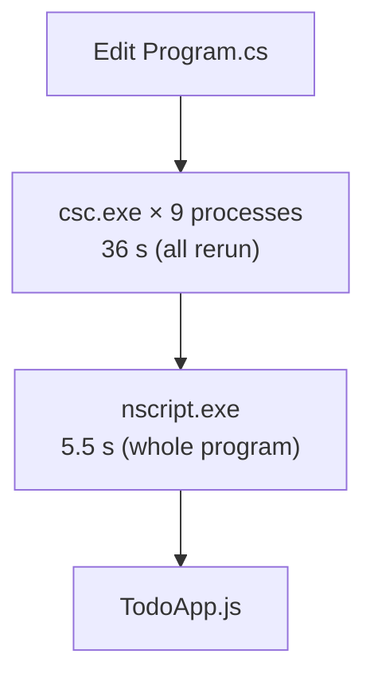
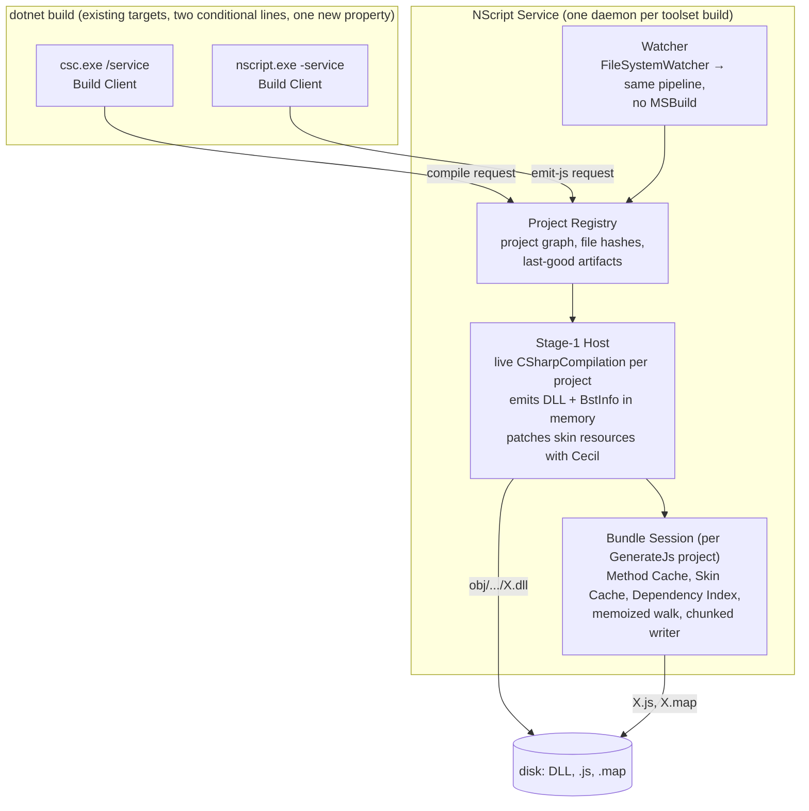
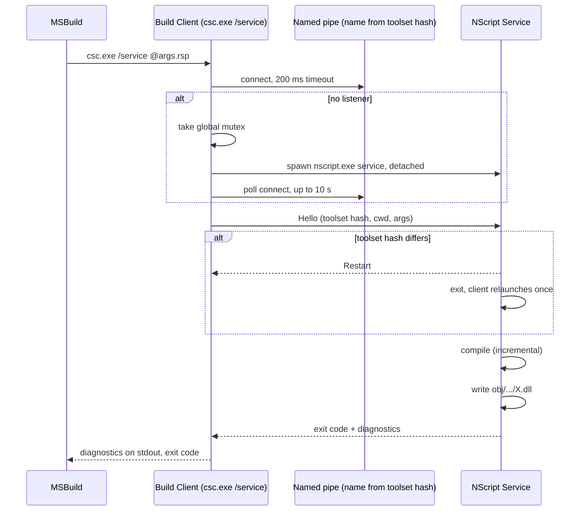
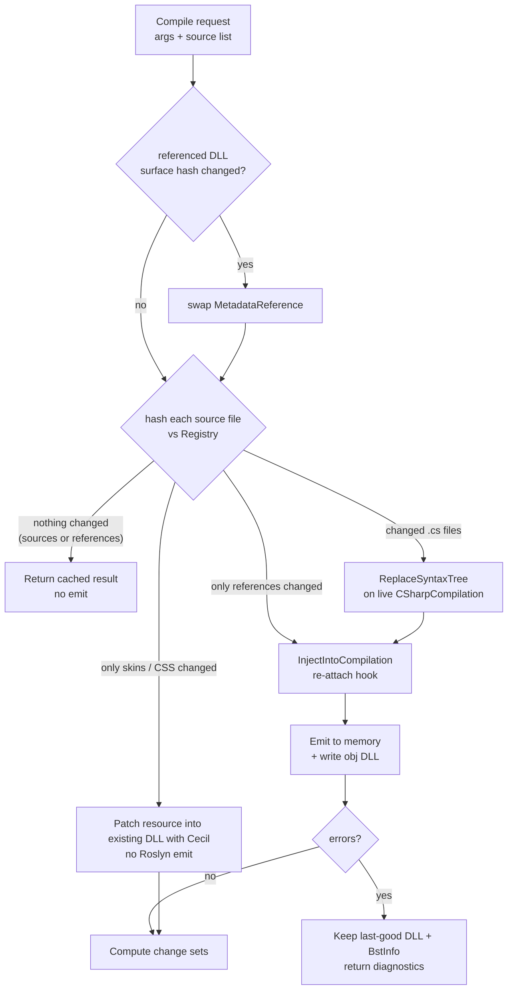
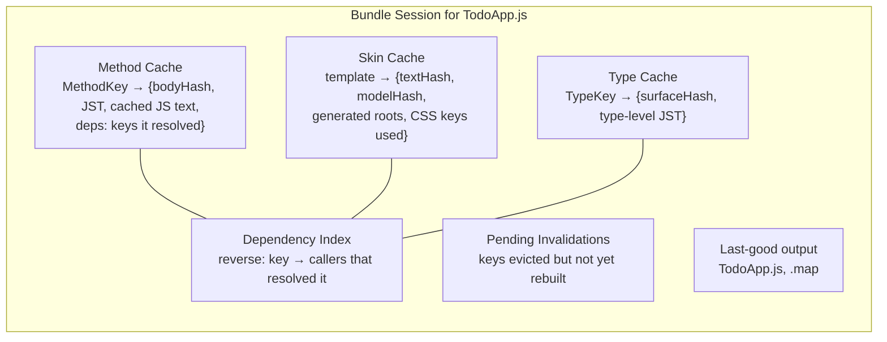
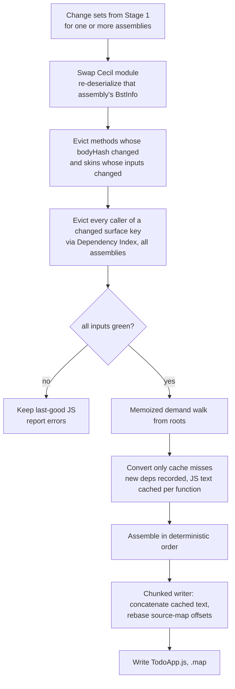
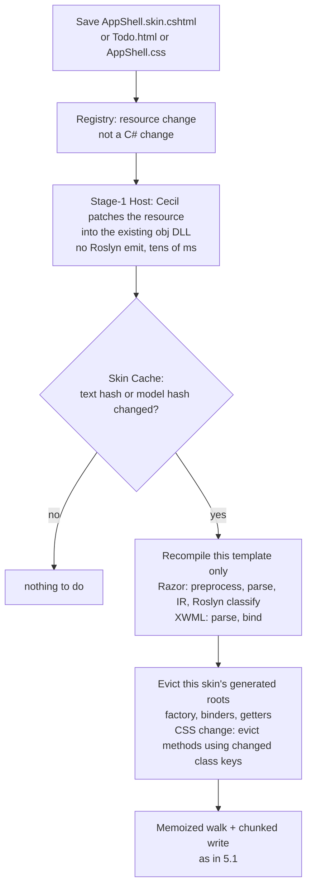
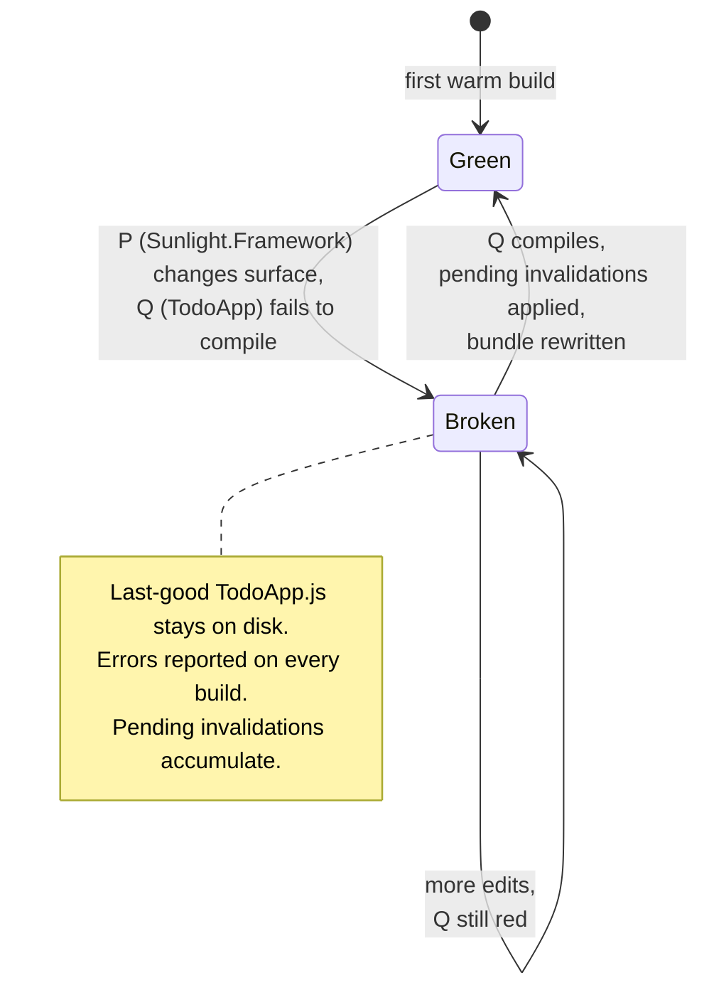
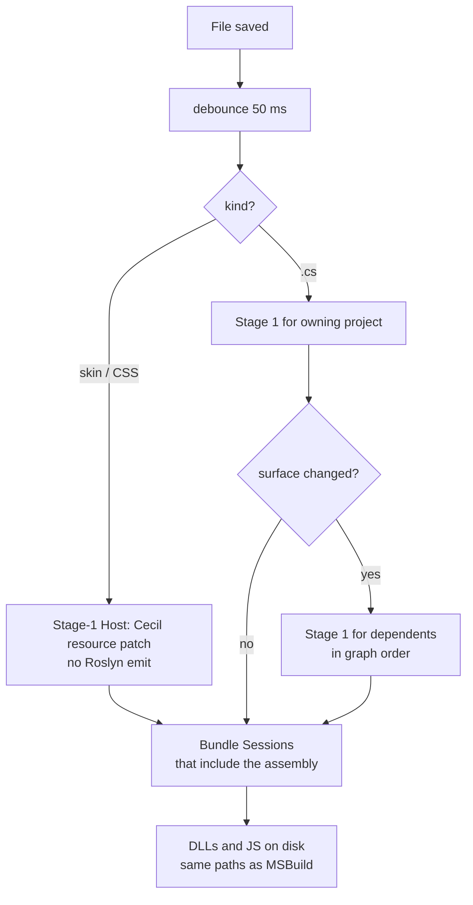

# Plan: NScript build service — edit to JavaScript in under a second

**Status:** Revision 2, after Gautam's line review of revision 1. Nothing here is implemented.

**Outcome:** `dotnet build -p:NScriptService=true` routes every project through one long-lived NScript service. After the first warm build, a method-body edit produces updated JavaScript in under 1 s, a skin edit faster still, and a signature change in a few seconds. A breaking change leaves the last good JavaScript untouched and reports errors until the sources compile again. Service output is a **dev-mode** build: Release builds stay batch and are unchanged.

**Done when:**
- Body edit in TodoApp, then `dotnet build -p:NScriptService=true`: stage 2 finishes in under 1 s with conversion under 100 ms, and the emitted `TodoApp.js` is identical to a batch dev-mode build of the same sources.
- Skin edit (`.skin.cshtml` or XWML `.html`) in watch mode: JavaScript updated in under 500 ms with no stage-1 recompile.
- Signature change that breaks a caller: errors reported, `TodoApp.js` untouched. Fix the caller: next build rewrites the JavaScript correctly.
- Watch mode (`NScriptWatch=true`): saving a file updates the JavaScript with no MSBuild run.
- Service resident memory for all five demo bundles stays under 500 MB (measured in slice 1 before slice 2 commits to the cache design).
- The only change an app project sees is one MSBuild property, which turns into one flag on `csc.exe` and one on `nscript.exe`.

---

## 1. Where the 50 seconds go today

Measured on 2026-10-07, TodoApp, Debug, one comment line appended to `Program.cs`:

| Step | Time | Why |
|---|---|---|
| CoreCompile, 9 projects | 36 s | Every framework project recompiles every build. A package-metadata target rewrites an embedded `.repo.bin` input on each run, so MSBuild never sees CoreCompile as up to date. |
| cs2jsc for TodoApp | 5.5 s | Whole program every time: deserialize 6 DLLs (0.6 s), Razor plugin init (2.2 s, mostly cold Roslyn), walk + convert (2.8 s), naming (25 ms), write JS + map (0.5 s). |
| MSBuild, git calls, packing | ~8 s | Three `git` processes per framework project, NuGet pack of every framework project. |



Two conclusions drive the design. First, process startup and whole-program rework dominate, not the actual work on the edited method. Second, the per-method conversion (`MethodConverter` → one `FunctionExpression`) already exists as an in-memory unit, so caching it is a refactor, not a rewrite.

## 2. Who does what



- **Build Client** lives inside the existing `csc.exe` and `nscript.exe`. With the flag it finds the service over a named pipe, launches it if missing, forwards the exact command line, and prints the returned diagnostics in the normal MSBuild format. Without the flag nothing changes.
- **NScript Service** is `nscript.exe service`. Same binaries, same plugins, same Roslyn fork. One instance per toolset directory and user, keyed by a hash of the toolset path. It exits after an idle timeout unless watching.
- **Project Registry** learns the project graph from the command lines it receives: references are DLL paths, and a DLL path produced by one request is a reference in another. No project-file parsing. It also classifies each changed file: C# source, skin template, CSS, or other resource. C# changes go to the Stage-1 Host for a Roslyn emit; skin and CSS changes go to the Stage-1 Host only for a Cecil resource patch, never a Roslyn emit.
- **Stage-1 Host** keeps one `CSharpCompilation` per project and replaces only changed syntax trees. It re-attaches the `OnBoundExpressionGenerated` hook before each emit, because the fork does not copy it across `ReplaceSyntaxTree`.
- **Bundle Session** is the incremental version of today's `Builder.Execute`: one per output bundle, holding the converter state across builds.
- **Watcher** is the same pipeline triggered by file events instead of MSBuild. It only exists in watch mode.

## 3. How a request moves: discovery and launch



MSBuild still decides what to build and in which order. The service only makes each step fast. Because it writes the same artifacts to the same paths, MSBuild's own up-to-date checks keep working, which is what lets watch mode and MSBuild coexist.

Fallback: if the service cannot be reached after one relaunch, the client compiles locally exactly as today and prints a warning. The build never fails because the service is missing.

## 4. Stage 1: incremental Roslyn with the NScript hook



**Change sets are the handoff to stage 2.** After a successful emit the host compares the new assembly with the last good one and produces three sets, keyed by stable names, never by the per-compilation integer ids inside `$$BstInfo$$`:

- **Body changes:** per method, a content hash of its serialized body with every symbol id replaced by its name-based spec. Different hash → that method changed.
- **Surface changes:** per type and member, a hash of what callers see: signature, static/virtual flags, attributes that affect conversion such as `KeepInstanceUsage`, base type, interfaces, type kind, and constructor shape (the converter inspects constructor IL to classify types).
- **Resource changes:** which embedded skin, XWML or CSS resources changed, by resource name. These come from the Registry's file hashes and never trigger a Roslyn emit (section 6).

A body-only change in project P never recompiles projects that reference P. A surface change does, and the Registry cascades it in dependency order using the same references MSBuild passed.

**Roslyn cost and the fork.** Roslyn re-binds all method bodies on every `Emit`. For TodoApp-sized projects that is expected to be sub-second once warm; slice 1 measures it. If it is not, the fork is on the table, exactly as it was for the existing hooks: expose Roslyn's per-method `filterOpt` emit path, or add a hook that lets the serializer skip bodies whose syntax did not change. Either is a small, surgical change in the spirit of ADR 0002 and gets its own ADR.

## 5. Stage 2: the Bundle Session

This is the part Gautam called the hard part: keeping the graph in memory. The session state is deliberately small, and section 5.2 sets its memory budget.



- **MethodKey** = assembly simple name + `MethodDefinition.FullName`. **TypeKey** likewise. Both survive a module swap. Cecil object identity does not, so every cache is keyed by these strings, and the comparer that caches hash codes by object reference becomes per-session instead of static.
- **deps** are recorded by instrumenting the existing `Resolve*` calls: while `MethodConverter` converts method M, every key it resolves is appended to M's dependency list. The reverse index is built from those lists. Skins record the same way, plus the CSS class keys they use.
- **`DependencyAnalyzer`** stays what it is today: the type-ordering graph used by `Convert` and `TypeConverter`, keyed by Cecil objects. It is not the Dependency Index. Because it is keyed by Cecil objects, the session drops and rebuilds its entries for every swapped assembly.
- **Pending Invalidations** is what makes the "broken until fixed" behaviour correct. Invalidations from a surface change are applied to the cache immediately, but the rebuild waits until every input assembly is green.

### 5.1 Incremental emit



**The walk is re-run every time, but conversion is not.** The walk starts from the same roots as today (entry point, module initializers, plugin and skin roots). For a cache hit it enqueues the method's recorded deps without touching the body. For a miss it converts, which records fresh deps. This handles both cases Gautam described with one mechanism: a changed body that now calls a method not yet in the bundle is simply a miss that pulls its callees in, and a method nobody calls any more is never reached and drops out. No reachability counts to maintain.

**Dev-mode output makes the writer incremental too.** Gautam's rule: service output does not have to match a Release build, only work. So in service mode the session does not run usage-ordered minification or the optimize passes. Every identifier gets a stable name derived from its identity (type and member name, local slot), which means a function's JavaScript text never changes unless its own body or a callee's surface changes. The writer therefore keeps each function's emitted text and source-map segment in the Method Cache and only re-serializes misses. Assembly is concatenation plus re-basing of source-map line offsets. Naming cost is already 25 ms; this removes most of the 0.5 s writer cost as well.

**The oracle survives.** Batch `nscript.exe` gets the same `-devMode` switch (stable names, no optimize). A batch dev-mode build of the same sources must be byte-identical to the service output, so every slice is still testable by diff. Release output is produced only by batch builds and is untouched by this plan.

### 5.2 Memory budget

Gautam's concern: graph lookups must be fast and the stored graph must not cost much more RAM than the output it describes.

- **Keys are interned integers.** Every MethodKey, TypeKey and CSS key is interned once into a per-session table; caches and the Dependency Index are `int`-keyed dictionaries and `int[]` adjacency lists. Lookups are single hash probes; eviction of a method's callers is one array walk.
- **Nothing is stored twice.** The BST (`$$BstInfo$$`) stays as the lazily parsed bytes it already is; the parsed AST is dropped after conversion. The cache keeps the JST plus its emitted text. The Cecil module is kept once per assembly and shared by every Bundle Session that references it.
- **Framework bodies are shared, not copied.** Converted JST for `mscorlib` or `Sunlight.Framework` methods differs per session only in identifier objects. The plan keeps one converted copy per session for simplicity and measures first; a shared immutable JST with per-session name binding is the fallback if the measurement is over budget.
- **Budget and gate.** Target under 500 MB resident for all five demo bundles warm. Slice 1 reports the number, slice 2 is not accepted without it. Idle sessions are dropped after a timeout; the DLL and last-good JS on disk let them rebuild on demand.
- **Basis for the estimate:** `TodoApp.js` is 384 KB. A JST tree is typically 5-10× its text, plus the text itself and the maps, so one bundle is of the order of 5-10 MB; five bundles plus shared Cecil modules and Roslyn compilations fit the budget with margin. This is an estimate, not a measurement.

## 6. Skins: the fastest path

Gautam edits skins more often than C#, and there are two kinds: Razor `.skin.cshtml` (plus its CSS) and XWML `.html` templates. Today a skin edit costs the full 50 s because the template is an embedded resource: MSBuild sees a changed input, recompiles with Roslyn to re-embed it, then runs the whole of cs2jsc. In the service, a skin edit never triggers a stage-1 recompile.



- **Per-template cache.** `RazorTemplatingPlugin.Initialize` compiles every template today. In the session each template is cached by its text hash plus the surface hash of the model types it binds to. Only the changed template recompiles. Warm Razor work for one template is about 10 ms in today's log (the 2.2 s is cold Roslyn plus the first template). Razor's binding classification (ADR 0020) uses its own small Roslyn compilation per template; that is inside the 10 ms and is not a stage-1 recompile.
- **Model changes reach skins through the same Dependency Index.** A skin records the TypeKeys and MemberKeys it binds. A surface change on a view model evicts the skin like any other caller.
- **CSS.** Razor's CSS-literal replacement makes method bodies depend on the global CSS class map. Methods and skins record the class keys they use; a CSS edit evicts only those.
- **XWML** follows the same path through `XwmlTemplatingPlugin`: its global CSS-name compression is recomputed from the cached per-template results, not re-parsed.
- **DLL consistency.** The resource patch keeps `obj/.../X.dll` truthful, so a later MSBuild-driven build sees nothing to do. A failed template compile keeps the last-good skin output and reports the template diagnostics, the same rule as C#.

## 7. Two traces through the same names

### Trace A: body edit, `TodoViewModel.AddTask` now calls `Validator.Check`

1. Watcher or MSBuild sends a compile request for TodoApp. One file hash differs. `ReplaceSyntaxTree`, re-attach hook, emit. Body change set = {`TodoApp:TodoViewModel.AddTask`}. Surface change set = {}.
2. Bundle Session evicts `AddTask` from the Method Cache. No surface change, so the Dependency Index is not consulted.
3. Memoized walk reaches `AddTask`: miss, convert. Conversion resolves `Validator.Check`, which is not in the cache: miss, convert, record deps. Its callees are already cached.
4. Assemble: two new function texts, everything else concatenated from cache. Write.

### Trace B: signature change, then the fix



1. `Sunlight.Framework` changes a method signature. Stage 1 emits it fine. Surface change set = {that method}.
2. Registry cascades: TodoApp references the framework, so TodoApp recompiles with the swapped reference. It fails. Stage 1 keeps TodoApp's last-good DLL and returns errors to MSBuild.
3. Bundle Session for `TodoApp.js` applies the framework's change sets: evicts the changed method and, via the Dependency Index, every caller across all assemblies, skins included. It then sees TodoApp is not green and holds. `TodoApp.js` is untouched.
4. Gautam fixes the call site. TodoApp compiles. Its body change set names the fixed method. The session re-walks: the evicted callers are misses, get converted against the new signature, and the bundle is rewritten.

## 8. Watch mode



`NScriptWatch=true` implies the service flag and asks the service to watch every source file, template and CSS file it has been given. The first MSBuild run registers the projects; after that, saves rebuild without MSBuild. A later `dotnet build` finds artifacts newer than sources and skips, or round-trips to the service and gets a cached answer. Watch mode never writes to paths MSBuild did not already write to.

## 9. How to build it

Each slice is end to end and measurable. The byte comparison against a batch dev-mode build is the oracle throughout.

0. **Prerequisite, approved by Gautam on 2026-10-07.** Add `WriteOnlyWhenDifferent="true"` to the two `WriteLinesToFile` calls in `Sources/Framework/NScript.PackageMetadata.targets`. **Done:** rebuild after a TodoApp edit runs CoreCompile only for TodoApp; wall time drops from ~50 s to roughly 15 s (basis: 36 s of the measured 50 s is framework recompiles). **Status 2026-10-07: done.** The `Encoding="utf-8"` attribute also had to go, because MSBuild skips the content comparison when it is set. Measured: TodoApp edit build 53 s to 17 s, Csc calls 9 to 1; no-op solution build runs 0 Csc calls.

1. **Thin slice: service, client, flag, warm but not incremental.** New `nscript.exe service` host with the pipe protocol, discovery, launch, idle exit, toolset-hash restart. `csc.exe /service` and `nscript.exe -service` clients with local fallback. `Sdk.targets` forwards both flags when `NScriptService=true`: two conditional lines in the existing targets, approved with slice 0. Stage 1 hosted in-process with a live `CSharpCompilation` per project and `ReplaceSyntaxTree`; stage 2 runs today's `Builder` in-process in the daemon, with a stream-based `ClrContext.LoadAssembly` and module replacement. Add `-devMode` to batch `nscript.exe` (stable names, no optimize) so the oracle exists from day one. Reuse: `SerializationHelper.InjectIntoCompilation`, `Builder`, the existing JSONL log. Build a fresh `$$ResInfo$$` per emit instead of reusing the shared stream in `Csc.GetResourceFilePaths`. **Done:** second build after a body edit completes with no new processes; warm timings for every stage-2 phase and warm Roslyn emit are logged; resident memory for the five demo bundles is reported; output identical to batch dev-mode.

2. **Method Cache, memoized walk, chunked writer.** Interned keys, `deps` recording inside `RuntimeScopeManager.Resolve*`, cache-hit path in `ProcessMembers`, scope detachment for evicted methods, per-session comparer, per-assembly reset of `DependencyAnalyzer` entries on module swap, stable identity-based naming, per-function text and source-map segments. Body-hash change sets from stage 1. **Done:** Trace A scenario; stage 2 under 1 s on TodoApp with conversion under 100 ms; a swap-module test asserts no cache or ordering entry still holds an old Cecil object; memory within budget; output identical to batch dev-mode.

3. **Skins.** Resource classification in the Registry, Cecil resource patch in the Stage-1 Host, Skin Cache with per-template recompile for Razor and XWML, CSS key dependencies, skin roots through the Dependency Index. **Done:** edit `AppShell.skin.cshtml`, an XWML template and `AppShell.css` in turn; each updates the JavaScript in under 500 ms with the Roslyn emit counter unchanged; e2e TodoApp suite passes.

4. **Surface change sets, cascade, last-good semantics.** Surface hashing in the Stage-1 Host, reference swap and dependent recompile in the Registry, Dependency Index eviction, Pending Invalidations and the green gate. **Done:** Trace B scenario passes as a scripted test; `TodoApp.js` mtime unchanged while red.

5. **Watch mode.** `FileSystemWatcher` over registered sources, templates and CSS, debounce, kind classification, graph-ordered rebuild, `NScriptWatch=true`. **Done:** save a `.cs` and a `.skin.cshtml`; JS updates with no MSBuild; e2e TodoApp suite passes against watch-produced output.

6. **Only if slice 1's measurements demand it.** Fork change for per-method Roslyn emit (`filterOpt` or a skip-unchanged hook, new ADR); shared immutable framework JST across sessions.

Validation for every slice: the four browser suites and the benchmark check from `CLAUDE.md`, run against service-produced output, plus a byte comparison with batch dev-mode output. Release output is built in batch and compared against its own baseline, unchanged.

## 10. Decisions taken

- **Build-file edits (slices 0 and 1):** approved by Gautam in the revision 1 review on 2026-10-07.
- **Dev-mode output:** Gautam's rule that service builds need not match Release is adopted as the basis for stable naming and the chunked writer (section 5.1). Release stays batch.
- **Roslyn fork:** changes for this work are allowed when measurements justify them (section 4, slice 6).

No open decisions remain.

## 11. Material risks

- **Cecil identity churn.** Swapping a module invalidates every `MethodDefinition` object from that assembly. Every cache keys by name string, and anything still holding old Cecil objects is a bug. Mitigation: per-session comparer, eviction tests that swap a module and assert no old reference survives.
- **Hidden body dependencies.** Call-site shape depends on callee declaration, with known exceptions: constructor IL shape, Razor CSS-literal encapsulation. Each is folded into the surface hash or into recorded CSS keys. Any missed case shows up as a diff against batch dev-mode output, which is why the oracle is non-negotiable.
- **Stable names collide.** Identity-based names must be unique per scope without the global minifier. Compiler-generated members and overloads need a deterministic suffix rule; the diff oracle catches any collision as a behavioural failure in the browser suites.
- **Compiler-generated names shift.** Adding a lambda renames sibling `<M>b__3_1` methods. This causes extra invalidations, never missed ones.
- **Emit cost in stage 1.** Roslyn rebinds every body per emit. Not measured warm yet; slice 1 measures it before slice 2 assumes it, and the fork is the fallback.
- **Memory.** The 500 MB budget is an estimate. Slice 1 measures it; shared framework JST is the fallback.
- **Parallel MSBuild nodes.** Requests for independent projects arrive concurrently. The service serializes per project and per bundle session, and compiles independent projects in parallel.

**Now / next:** review this revision. If approved, slice 0 is a one-line change that pays off immediately; slice 1 is the first real service work.

---

## Appendix A: evidence and source anchors

- Timings: `.claude/scratchpad/conversation_memories/nscript-incremental-build-service/ledger.md` (MSBuild performance summary, cs2jsc JSONL log).
- CoreCompile invalidation: `Sources/Framework/NScript.PackageMetadata.targets` target `CaptureNScriptPackageRepoMetadata`, `WriteLinesToFile Overwrite="true"`.
- Hook lifetime: `roslyn/src/Compilers/CSharp/Portable/Compilation/CSharpCompilation.cs` field `_onBoundExpressionGenerated`; not copied by `Clone`/`Update`. Call site `MethodCompiler.cs:1197-1206`, before lowering, emit only. Per-method subset emit: `filterOpt` at `CSharpCompilation.cs:3739`.
- In-process stage 1 already used by tests: `Test/Compiler/NScript.Csc.Lib.Test/CrossAssemblyInternalCrashTests.cs:268-292`.
- Per-method conversion unit: `TypeConverter.AddMethodToImplementation` (`TypeConverter.cs:387-422`) → `MethodConverter` ctor (`MethodConverter.cs:177-277`).
- Worklist: `RuntimeScopeManager.cs:1497-1574`; enqueue side effects in `Resolve*` (`:846-893`, `:1004-1080`, `:697`, `:1433`).
- Type ordering graph: `DependencyAnalyzer`, used at `RuntimeScopeManager.cs:165-499`, `TypeConverter.cs:1717`.
- Templates read from embedded resources: `RazorTemplatingPlugin.cs:216-278`, `XwmlParser/CodeGenerator.cs:188-217`; Razor per-template phases logged in `RazorSkinCompiler.cs:30-62`; CSS-literal encapsulation `RazorTemplatingPlugin.cs:1043-1077`.
- Path-only loader: `NScript.CLR/ClrContext.cs:105-155`; "Assembly already loaded" at `:146-149`.
- Static comparer cache: `NScript.CLR/TypeHelpers.cs:2073-2090`.
- Shared-compilation client that never runs: `NScript.Csc.Lib/BuildClient.cs:85-101`, `BuildServerConnection.cs:379-476`.

## Appendix B: protocol sketch (JSON lines over the pipe)

```
→ {"type":"hello","toolsetHash":"…","pid":1234}
→ {"type":"compile","cwd":"…","args":["/noconfig","@obj/…/TodoApp.rsp"]}
← {"type":"result","exitCode":0,"diagnostics":[{"file":"…","line":12,"col":5,"code":"CS0103","severity":"error","message":"…"}]}
→ {"type":"emitJs","cwd":"…","args":["-outJs","…","-entryAssembly","…","-references","…","-devMode"]}
← {"type":"result","exitCode":0,"diagnostics":[],"outputs":["…/TodoApp.js","…/TodoApp.map"]}
→ {"type":"watch","enable":true}
→ {"type":"shutdown"}
```

The copied Roslyn `BuildClient`/`BuildServerConnection` is not reused: its protocol is binary, assumes `VBCSCompiler`, and hard-codes `isRunningOnCoreClr = false`. The new protocol is about 200 lines.
