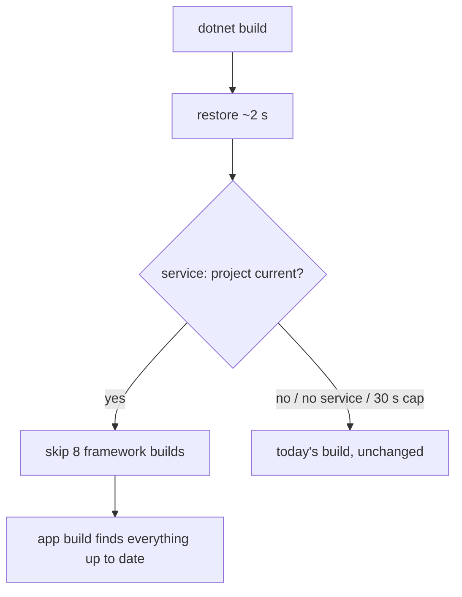

# Plan: `dotnet build` asks the watching service first

**Done when:** after a one-line edit on TodoApp, with the service watching, `dotnet build --no-restore` p50 ≤ 1.5 s and plain `dotnet build` p50 ≤ 3.5 s (today p50 9.3 s). The JS is byte-equal to the service's last emit (dev-mode JS, the same a watch save gives; a watch-mode `-p:NScriptWatch=true` build writes the same bytes), and the compiler command line and inputs are identical to today's build. (DLL bytes can't be the check: two plain compiles of TodoApp already differ, backlog B23.) Every case the service can't vouch for falls back to today's build.

Plain `dotnet build` can't reach 1 s. Restore alone takes ~2 s (measured: 9265 → 7230 ms with `--no-restore`) and runs before any NScript step. Saving a file in watch mode stays the 1 s path (0.84–0.9 s measured).

## Where the 9.3 s goes today (measured, TodoApp edit)
- NScript's own work: ~1.2 s (compile 0.45 s + JS 0.78 s).
- MSBuild re-checking 8 framework projects: ~4 s.
- Restore ~2 s, evaluation ~2 s, 24 git calls for package metadata ~2.7 s.
- With `-p:NScriptWatch=true` it is worse: 11–15 s, because it forces all 9 compiles.

## Key dots
1. **Measure first, no code.** tester-m2 times the real path (save → the service writes the JS → `dotnet build`), a build with the framework referenced as plain DLLs, and the service round trip.
   - **Stop rule:** if the best proxy's `--no-restore` p50 is over 2 s, I report back before writing service code.
2. **`nscript service --sync <project>`.** It asks the service: "is this project and everything it uses current?" If not, the service queues the work, waits for its normal batch, and answers. It never runs a second batch. It waits at most 30 s, then says "no".
3. **MSBuild trigger.** One small target before the build calls `--sync`. On "yes", MSBuild skips rebuilding the 8 framework projects (`BuildProjectReferences=false`). On anything else, today's build runs unchanged.
   - It arms with no extra flag when the service is watching this project, so plain `dotnet build` is the trigger. MSBuild detects this with an `Exists` check on a marker file the service writes in the project's `obj` folder when it starts watching and deletes when it stops: no process start, ~0 ms.
   - `-p:NScriptWatchSync=false` turns it off.
4. **New and deleted files are caught.** `--sync` compares each project's source file list with what the service last saw. Any difference means "no", so a git checkout can't leave a stale build.
5. **Only if measurement says so:** the JS step reuses the service's answer (only if the re-emit costs >300 ms), and the framework is referenced as plain DLLs while synced (only if dot 1 shows it is needed to reach 1.5 s).

## Proof
- Timings: n=10, p50/p90, host load next to each number, before and after.
- Byte-equal JS, identical csc command line and `bin` file hashes against `-p:NScriptWatchSync=false` for each fallback case: no service, not watching, failed build, new file, Clean, `-c Release`, JS overwritten.
- Hard cases, each must fall back or finish correctly: a source file held locked during sync (30 s cap → fallback); a 200-file save storm; a forced watcher overflow plus a new `.cs` from git checkout; the service killed mid-sync (build still passes).
- Hand tests of every `--sync` answer, plus the 4 browser suites and the benchmark.

## Material risks
- A build that skips the framework projects doesn't refresh their commit SHA stamp or the NuGet packages in `NScriptToolSet`. Listed as known gaps; a full build fixes both.
- Solution (`.sln`) builds skip the trigger: the framework builds alongside them.
- A synced build's project-reference items lack 12 metadata names that only MSBuild's evaluation of the referenced project adds (TargetFrameworks, AdditionalPropertiesFromProject, ...). Nothing after reference resolution reads them: csc, nscript and JS are equal. Listed in a comment next to the injecting target.
- The injected reference comes from `obj/nscript.targetpath`, which a watch build writes. Framework projects get the same 8-line target in `Sources/Framework/Directory.Build.props`. No record means today's project references.
- After a skin save, a synced build still recompiles the app locally (the patched DLL has no PDB link) and writes non-dev JS. Open question to you.

## Moved to backlog (your side-task rule)
- B20: replace the 24 git calls with values .NET already computes. Saves an estimated 1.5–2 s on every non-watch build, but it changes the metadata packed into the NuGet packages, so it is a separate task.

**Later question for you (after the numbers):** should a vouched build also skip the app's own build steps? ~0.5–0.8 s more, but `bin` copies of framework DLLs can go stale. Safe default: don't skip.

**Result (measured, calm host, n=10, TodoApp, service watching):** `dotnet build --no-restore` no-change p50 1174 ms (off: 6220). Plain `dotnet build` no-change p50 3134 ms, after a `.cs` save 3170 ms (off: ~10.3 s). Restore is 2.1 s of the plain build. Dot 5's reference swap was needed; the cached JS answer was not.
