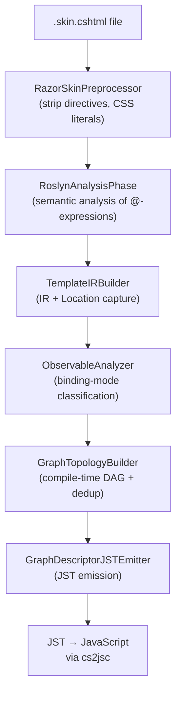

# Razor skin templates

> **Audience:** *App authors*.

## TL;DR

Razor templates are NScript's **modern template frontend** ([ADR 0017](../adr/0017-add-razor-skin-templates-as-a-second-template-frontend.md)). A `.skin.cshtml` file declares a model type, optional CSS dependencies, and a fragment of HTML interleaved with `@`-prefixed C# expressions, `@if`, `@foreach`, and child-control references. The compiler analyses the model with Roslyn ([ADR 0020](../adr/0020-auto-detect-binding-mode-from-roslyn-semantic-analysis.md)) to auto-classify each binding as OneTime / OneWay / TwoWay, builds a compile-time DAG of reactive nodes ([ADR 0018](../adr/0018-replace-independent-binders-with-compile-time-reactive-binding-graph.md)), and emits JavaScript that materialises a live, deduplicated binding graph at runtime via `GraphBindingStrategy` ([ADR 0019](../adr/0019-extract-ibindingstrategy-from-skininstance.md)).

## Quick start

`TodoItemControl.skin.cshtml`:

```cshtml
@model TodoApp.ViewModels.TodoItemViewModel
@styles "TodoApp.RazorTemplates.AppShell.css"

<div class="@Model.CssClass" draggable="true"
     onclick="@Model.OnSelect" ondragstart="@Model.OnDragStart">
    <div class="@Model.CheckboxClass" onclick="@Model.ToggleComplete">&#10003;</div>
    <div class="todo-title">@Model.Title</div>
    <div class="@Model.StarClass" onclick="@Model.ToggleImportant">@Model.StarText</div>
</div>
```

The accompanying viewmodel:

```csharp
public class TodoItemViewModel : ObservableObject
{
    [AutoFire] public string Title { get; set; }
    [AutoFire("CheckboxClass")] public bool IsCompleted { get; set; }
    [AutoFire("StarClass", "StarText")] public bool IsImportant { get; set; }

    public string CssClass => this.IsCompleted ? "todo completed" : "todo";
    public string CheckboxClass => this.IsCompleted ? "btn-check checked" : "btn-check";
    public string StarClass => this.IsImportant ? "btn-star starred" : "btn-star";
    public string StarText => this.IsImportant ? "★" : "☆";

    public void ToggleComplete() => this.IsCompleted = !this.IsCompleted;
    public void ToggleImportant() => this.IsImportant = !this.IsImportant;
    public void OnSelect() { /* ... */ }
    public void OnDragStart() { /* ... */ }
}
```

The compiler emits a single graph that:

- Reads `Title` once at materialisation (no observed mutation paths) — OneTime.
- Subscribes to `IsCompleted` so `CssClass` and `CheckboxClass` update reactively — OneWay (auto-detected because `[AutoFire]` is on the dependency).
- Wires `onclick` handlers as event delegates pointing to viewmodel methods.

## Reference — directives

| Directive | Purpose |
|---|---|
| `@model FullyQualifiedTypeName` | Required at top of file. Specifies the data context type. |
| `@styles "Resource.Name.css"` | Declares a CSS dependency. The CSS file is parsed by `CssParser` and class names are matched strictly against `class="..."` attributes; mismatches surface as compile diagnostics ([ADR 0016](../adr/0016-standardize-xwml-as-the-canonical-template-language-with-strict-css-and-binding-diagnostics.md)). |
| `@Model.X` | Substitutes the value of `Model.X`. |
| `@Model.Method(arg)` | Invokes a method (typically as an event handler). |
| `@(expression)` | Parenthesised expression — required when the expression contains spaces, ternaries, or any token that would confuse the implicit boundary. |
| `@if (cond) { ... }` | Conditional fragment. Auto-classified OneWay when `cond` references observable properties. |
| `@foreach (var x in Model.List) { ... }` | Repeats a fragment for each item. When `Model.List` is `IObservableCollection`, additions/removals reactively update the rendered list. |
| `<TodoItemControl />` | Reference to a child Razor control by class name (auto-discovered from `Sunlight.Framework.UI.Skin` registry). The current `Model` flows through; inside an `@foreach`, the iteration variable becomes the child control's `Model`. |

## Reference — binding modes (auto-detected)

[ADR 0020](../adr/0020-auto-detect-binding-mode-from-roslyn-semantic-analysis.md) — there is no `Mode=` annotation in Razor templates. The compiler classifies each `@Model.X` reference based on:

- **OneTime** — `X` is a constant, a non-observable readonly value, or has no observable inputs.
- **OneWay** — `X` is on an `INotifyPropertyChanged` source and reads from properties marked `[AutoFire]` or that emit `FirePropertyChanged`.
- **TwoWay** — the `@Model.X` appears as the value of a writable form field (`<input value="@Model.X">`) AND `X` has an accessible setter on an observable type.

If you need to override (rare), wrap the value in a method on the viewmodel that exposes the desired observability surface — the auto-detector picks up the method's reachable observables.

## Reference — emitter pipeline



The IR + DAG model is what enables:

- **Dedup** — two `@Model.X` references in the same template share one DAG node.
- **Comment markers** in generated JS for traceability between source and emitted code.
- **Source mapping** — `TemplateIRBuilder` captures source `Location` per IR node so debugger steps land on the right template line ([ADR 0006](../adr/0006-standardize-the-compiler-pipeline-from-bound-csharp-to-javascript.md), source-map work in WI-15).

## Reference — strict CSS

`@styles "X.css"` causes `CssParser` to parse the file at compile time. Every `class="foo bar"` attribute on a literal element is checked against the declared classes. Diagnostics:

| Code path | Message shape |
|---|---|
| Class used in template, not declared in any referenced CSS file | "CSS class 'foo' used in template not found in declared stylesheets" |
| Class declared but never used | (warning) "CSS class 'foo' declared but unused" |
| Selector cannot be parsed | parse-position-aware error from `CssParser` |

`Autoprefixer` also runs over the declared CSS to inject vendor prefixes; its scope is the parsed CSS, not the template HTML.

## Examples

### Conditional block

```cshtml
@if (Model.HasItems)
{
    <ul>
        @foreach (var item in Model.Items)
        {
            <li>@item.Name</li>
        }
    </ul>
}
else
{
    <p class="empty">No items.</p>
}
```

### Two-way input binding

```cshtml
<input type="text" value="@Model.SearchText" onchange="@Model.OnSearchTextChanged" />
```

`SearchText` is on an `ObservableObject` and has a setter → auto-classified TwoWay. `OnSearchTextChanged` is a viewmodel method invoked from the DOM `change` event.

### Embedded child control

```cshtml
@foreach (var todo in Model.CurrentTodos)
{
    <TodoItemControl />
}
```

The current iteration variable `todo` becomes the `Model` of the child `TodoItemControl`.

### Compound CSS class via ternary

```cshtml
<div class="@(Model.IsSelected ? "item selected" : "item")">…</div>
```

`@(...)` is required because the expression contains a space — without parentheses the parser stops at the first whitespace.

## Known gotchas

### Implicit / explicit boundary

`@Model.Foo` and `@Model.Foo.Bar` work, but `@Model.Foo Bar` is parsed as `@Model.Foo` followed by literal text " Bar". When in doubt, use `@(...)`.

### `@foreach` over a non-observable list is OneTime

If `Model.Items` is plain `List<T>` (not `IObservableCollection`), the loop is rendered once at materialisation and never updates. To get reactive list updates, use `ObservableCollection<T>`.

### Razor and XWML coexist

A project can have both `.skin.cshtml` and `.html` (XWML) templates. They produce equivalent runtime structures — `SkinInstance` is the common base. Pick one per control, not per project.

### Child control lookup is by simple name

`<TodoItemControl />` is resolved through the skin registry built from referenced assemblies. Two controls with the same simple name in different namespaces will collide; rename one.

### `@styles` is a compile-time hint, not a runtime CSS loader

The browser still needs to load the CSS file (via a `<link>` tag in the host page or by your bundler). `@styles` only opts the template into strict-class checking; it does not produce a `<link>` element.

## Diagnostics

| Symptom | Cause |
|---|---|
| `CSS class 'foo' used in template not found` | Class on an element not declared in any referenced CSS file |
| `Cannot resolve member 'Foo'` | Property/method missing on the `@model` type |
| Bound value never updates | Source property missing `[AutoFire]` / `FirePropertyChanged`; auto-detector classified as OneTime |
| Two-way binding writes back blank | Source property has no setter — falls back to OneWay; check `IsStrict` to surface the mismatch |
| Child control renders nothing | Type name not found in `Skin` registry; check `[Skin]` and assembly references |

## Cross-links

- [ADR 0017 — Razor as second frontend](../adr/0017-add-razor-skin-templates-as-a-second-template-frontend.md)
- [ADR 0018 — Compile-time DAG binding](../adr/0018-replace-independent-binders-with-compile-time-reactive-binding-graph.md)
- [ADR 0019 — `IBindingStrategy` extraction](../adr/0019-extract-ibindingstrategy-from-skininstance.md)
- [ADR 0020 — Auto-detect binding mode](../adr/0020-auto-detect-binding-mode-from-roslyn-semantic-analysis.md)
- [ADR 0016 — XWML strict CSS / binding diagnostics](../adr/0016-standardize-xwml-as-the-canonical-template-language-with-strict-css-and-binding-diagnostics.md)
- [XWML templates (legacy)](xwml.md)
- [Sunlight UI](../framework/sunlight-ui.md) for the host control hierarchy
