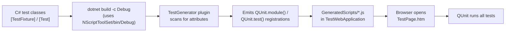

# Testing NScript

> **Audience:** *App authors* writing tests for their own NScript apps; *contributors* working on the NScript compiler test suite.

## TL;DR

NScript has two distinct test categories — they share no infrastructure and run on different stacks.

- **Compiler tests** (`Test/Compiler/`) — standard MSTest projects targeting `net6.0`. Run with `dotnet test`. Verify the C#-to-JS compilation pipeline (parsers, converter, JST emission, CSS parsing).
- **Framework tests** (`Test/Framework/`) — C# tests using `SunlightUnit` (`[TestFixture]` / `[Test]` attributes) compiled to JS by the NScript Debug compiler, then executed in a real browser via QUnit 2.2.0. Verify runtime behavior (observables, binders, templates, UI).

The `TestGenerator` plugin ([compiler/plugins.md](../compiler/plugins.md)) bridges SunlightUnit attributes into QUnit `module()` / `test()` calls during emission. Full architecture lives in [`Test/docs/browser-testing.md`](../../Test/docs/browser-testing.md).

## Reference — categories

| Category | Path | Stack | Runner | Target framework |
|---|---|---|---|---|
| Compiler | `Test/Compiler/*` | MSTest, .NET | `dotnet test` | `net6.0` |
| Framework | `Test/Framework/*` | SunlightUnit + QUnit 2.2.0 | Browser via `TestPage.htm` (or Playwright for headless) | `netstandard2.1` (compiled to JS) |

## Reference — compiler test projects

| Project | Surface tested |
|---|---|
| `NScript.Converter.Test` | C#-to-JS method conversion, snapshot-based regression tests |
| `NScript.CLR.Test` | Mono.Cecil-based CLR loader, type-system access |
| `NScript.Csc.Lib.Test` | Forked Roslyn integration, `OnBoundExpressionGenerated` capture, `$$BstInfo$$` round-trip |
| `NScript.JSParser.Test` | JS parser used by `[Script]` and Razor expressions |
| `NScript.Utils.Test` | Shared utilities |
| `NScriptTest` | Whole-pipeline regression tests, source-map checks |
| `CssParser.Test` | Strict CSS class parser |
| `RazorSkinParser.Test` | Razor `.skin.cshtml` parsing + binder graph emission |
| `XwmlParser.Test` | XWML template parser + emitted-binding graph |
| `SourceMap.Test` | Source-map encoder/decoder library |
| `SourceMap.Server.Test` | Source-map dev server (WI-15, WI-37); see [debugging/source-maps.md](../debugging/source-maps.md) |

## Reference — framework test pipeline



## Reference — `SunlightUnit.Assert` → QUnit mapping

`SunlightUnit.Assert` uses `[ScriptAlias]` ([interop/attributes.md](../interop/attributes.md)) so C# assertion calls translate directly to QUnit:

| C# (SunlightUnit) | Emitted JS (QUnit) |
|---|---|
| `assert.Equal(actual, expected, msg)` | `assert.equal(actual, expected, msg)` |
| `assert.IsTrue(value, msg)` | `assert.ok(value, msg)` |
| `assert.StrictEqual(actual, expected, msg)` | `assert.strictEqual(actual, expected, msg)` |
| `assert.DeepEqual(actual, expected, msg)` | `assert.deepEqual(actual, expected, msg)` |
| `assert.Throws(fn, msg)` | `assert.throws(fn, msg)` |

## Quick start — run the test suite

### Compiler tests

```bash
# All compiler tests (standard .NET test runner)
dotnet test NScript_Full.sln -c Release

# Single project
dotnet test Test/Compiler/CssParser.Test/CssParser.Test.csproj

# Single test by name
dotnet test Test/Compiler/NScriptTest/NScriptTest.csproj \
  --filter "FullyQualifiedName~MyMethodName"
```

### Framework tests

```bash
# 1. Build the Debug compiler (framework tests require it)
dotnet build NScript_Full.sln -c Debug

# 2. Serve the test web app
cd Test/Framework/TestWebApplication
npx serve .

# 3. Open http://localhost:3000/TestPage.htm in any browser.
# QUnit runs automatically; status banner shows pass/fail.
```

## Examples

### Writing a framework test

```csharp
using SunlightUnit;
using Sunlight.Framework.Observables;

namespace MyApp.Tests
{
    [TestFixture]
    public class ObservableTests
    {
        [Test]
        public static void FiringPropertyChangedReachesSubscribers(Assert assert)
        {
            var vm = new TodoItemViewModel();
            string lastChanged = null;
            vm.AddPropertyChangedListener("Title", (sender, name) => lastChanged = name);

            vm.Title = "Buy milk";

            assert.Equal(lastChanged, "Title");
        }
    }
}
```

The project file (`MyApp.Tests.csproj`) needs:

```xml
<PropertyGroup>
  <GenerateJs>True</GenerateJs>
  <JsOutputPath>../TestWebApplication/GeneratedScripts</JsOutputPath>
  <PluginConfig>PluginConfig.xml</PluginConfig>
</PropertyGroup>
```

And `PluginConfig.xml` registers the `TestGenerator`:

```xml
<Plugins>
  <Plugin Assembly="NScript.Converter.Plugins" ClassName="NScript.Converter.Plugins.TestGenerator" />
</Plugins>
```

Then add `<script src="GeneratedScripts/MyApp.Tests.js"></script>` to `TestPage.htm` and rebuild.

### Writing a compiler test (snapshot regression)

```csharp
[TestClass]
public class MyConverterRegressionTests : RegressionTests
{
    [TestMethod]
    public void Generic_Method_With_Constraints()
    {
        // RegressionTests provides input/expected loading + diff + snapshot update.
        this.RunRegressionTest("GenericMethodWithConstraints");
    }
}
```

The convention is one test per *snapshot pair*: `Inputs/GenericMethodWithConstraints.cs` + `ExpectedOutputs/GenericMethodWithConstraints.js`.

### Headless framework test execution (CI)

For CI runs you need Playwright to launch a real browser, navigate to `TestPage.htm`, and wait for QUnit's banner:

```javascript
// Pseudocode — see Test/docs/browser-testing.md for full pattern
const banner = await page.waitForSelector('#qunit-banner.qunit-pass, #qunit-banner.qunit-fail');
const passed = (await banner.getAttribute('class')).includes('qunit-pass');
```

Per-test results extract from `#qunit-tests > li` elements.

## Known gotchas

### Framework tests *must* use the Debug-built compiler

`Test/Framework/Directory.Build.props` pins `CscToolPath` to `NScriptToolSet/bin/Debug/`. If you only built Release, you'll see `csc.exe not found` or a stale toolset will silently miss recent changes. Always run `dotnet build -c Debug` once before framework tests.

### `[Test]` methods must be `public static`

The `TestGenerator` plugin emits a `QUnit.test()` registration that calls the method as a free function. Instance methods don't get registered. The test method's signature must be `public static void Foo(Assert assert)`. The containing `[TestFixture]` class can be either `public class` (the convention in `Test/Framework/Sunlight.Framework.Test/`) or `public static class` — both compile.

### `SunlightUnit.Assert` is *not* xUnit's `Assert`

The naming is similar but the semantics map to QUnit. Casing matters (`Equal` not `Equals`); argument order is `actual, expected` (matching QUnit), not `expected, actual` (which is xUnit's order). See the mapping table above.

### Browser cache breaks "fixed it but still failing" loops

Hard-refresh the test page (`Ctrl+Shift+R`) after rebuilding. Generated `.js` files are served with default caching headers; `npx serve` doesn't bust them.

### Compiler tests' snapshot files must be updated explicitly

The MSTest projects use snapshot comparison — when output changes intentionally, you re-run with `--update-snapshots` or use the `RegressionTests.UpdateSnapshot()` helper (depending on the test base class). Don't hand-edit the expected files.

### `TestGenerator` only runs when registered in `PluginConfig.xml`

A test project that forgets the plugin registration will compile to JS but emit no `QUnit.module()` / `QUnit.test()` calls — the file loads silently and runs nothing. Symptom: QUnit reports zero tests.

### Framework tests cannot use C# 8 features the compiler doesn't support

If a test uses `yield return`, `dynamic`, or other [unsupported features](../language/limitations.md), the build fails — but the failure mode is "compiles in stock C# fine, but `nscript.exe` reports the unsupported construct." Don't assume something works because Roslyn accepted it.

### TestLauncher is for debugging, not CI

`Test/TestLauncher` is a console app used to invoke a single compiler test directly, mostly for attaching a debugger to the compilation pipeline. Not part of normal CI runs.

## Diagnostics

| Symptom | Cause |
|---|---|
| `csc.exe not found` building framework tests | `dotnet build -c Debug` of root solution missing |
| QUnit reports `0 assertions, 0 tests run` | `TestGenerator` plugin not registered in `PluginConfig.xml`; or test method isn't `public static` |
| Framework test passes locally, fails in CI | Browser version mismatch, or stale `GeneratedScripts/` checked in — rebuild before run |
| Compiler test snapshot mismatch | Either a real regression or intentional output change — diff and update snapshot deliberately |
| `TestPage.htm` 404s on a script | Generated file missing from `GeneratedScripts/` — check that the test project's `<JsOutputPath>` points there and `GenerateJs=True` |

## Cross-links

- [Test/docs/browser-testing.md](../../Test/docs/browser-testing.md) — complete framework-test architecture and headless-runner script
- [Compiler plugins](../compiler/plugins.md) — `TestGenerator` internals
- [MSBuild SDK](../build/msbuild-sdk.md) — `<GenerateJs>` and `<PluginConfig>`
- [Source maps](../debugging/source-maps.md) — debugging failing JS tests in browser DevTools
- [Language limitations](../language/limitations.md) — features unavailable in framework tests
